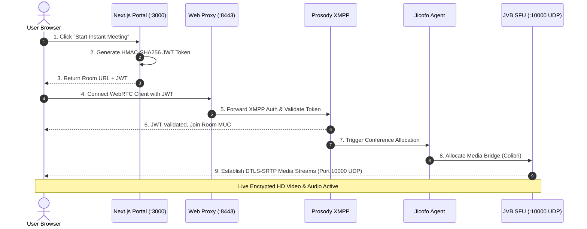

# 01. Architecture & Protocol Overview

Unity Meet is built as an enterprise-grade WebRTC conferencing platform consisting of 5 containerized microservices and standardized networking protocols.

---

## 🏛️ Microservices Stack

| Service | Container | Role | Key Technologies |
| :--- | :--- | :--- | :--- |
| **Portal** | `portal` | Modern UI frontend, meeting scheduler, JWT signing server | Next.js 14, React 18, `@jitsi/react-sdk`, Tailwind CSS, TypeScript |
| **Web** | `web` | Nginx reverse proxy, static Jitsi assets, WebSockets/BOSH endpoint, custom CSS | Nginx, OpenSSL TLS 1.3 |
| **Prosody** | `prosody` | XMPP signaling server, JWT validation module, MUC (Multi-User Chat) rooms | Lua, Prosody XMPP Server, `mod_auth_token` |
| **Jicofo** | `jicofo` | Conference focus agent, bridges participants, allocates JVB media channels | Java 17, XMPP Focus Component |
| **JVB** | `jvb` | Selective Forwarding Unit (SFU), WebRTC audio/video relay, Colibri REST API | Java, Colibri Protocol, libnice, WebRTC |

---

## 🌐 Network Protocols Used

### 1. WebRTC (Real-Time Communications)
- **Audio/Video Media:** Transmitted over **SRTP** (Secure Real-time Transport Protocol) with 128-bit / 256-bit AES encryption.
- **Key Exchange & Handshake:** Handled via **DTLS** (Datagram Transport Layer Security) over UDP port `10000`.
- **NAT Traversal & Candidate Discovery:** Uses **ICE** (Interactive Connectivity Establishment) and **STUN** (Session Traversal Utilities for NAT).
- **Data Channels:** Transmitted over **SCTP** (Stream Control Transmission Protocol) encapsulated in DTLS for chat, reactions, and dominant speaker events.

### 2. XMPP & Signaling Protocols
- **Client Signaling:** Browser clients establish secure WebSocket / BOSH connections to `wss://localhost:8443/xmpp-websocket` for presence and room state.
- **MUC (Multi-User Chat):** Prosody manages room occupancy (`muc.meet.jitsi`), presence, and speaker status.
- **Colibri Protocol (XMPP / REST):** Jicofo communicates with JVB over internal port `8088` to dynamically allocate and destroy video bridges for active conferences.

### 3. Authentication Protocol
- **JWT (JSON Web Token):** Cryptographically signed HMAC-SHA256 tokens issued by the Next.js portal and verified by Prosody before any user can create or join a room.

---

## 🔄 End-to-End Call Flow

---

## 💡 Selective Forwarding Unit (SFU) vs Mesh P2P

Unity Meet is optimized to use **SFU mode** (`p2p.enabled = false`):
* **No P2P Connection Timeouts:** Bypasses direct peer-to-peer ICE negotiation delays.
* **Scalability:** Each participant sends 1 video stream to JVB and receives only active speaker streams, reducing CPU and bandwidth consumption.
